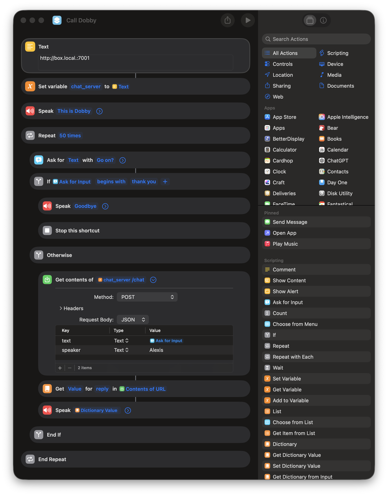

# iOS Shortcut Setup

Create the iOS Shortcut that connects HomePod to Clawpod.

## Prerequisites

- iPhone or iPad with iOS 16+
- Shortcuts app
- Clawpod server running and reachable

## Current Shortcut

The shortcut loops up to 50 times:

1. Ask for input ("Go on?")
2. If input begins with "thank you" → say goodbye and exit
3. Otherwise → POST to server, speak the reply
4. Repeat

## Step-by-Step

### 1. Create New Shortcut

Open Shortcuts → tap + → name it "Call Dobby"

### 2. Set Server URL

- Add **Text** action: `http://YOUR-SERVER:7001`
- Add **Set Variable** action: name it `chat_server`

### 3. Greeting

- Add **Speak Text** action: "This is Dobby"

### 4. Conversation Loop

Add **Repeat** action, set to 50 times.

Inside the loop:

**a. Get Input**
- Add **Ask for Input** action
- Prompt: "Go on?"

**b. Check for Exit**
- Add **If** action
- Condition: Provided Input begins with "thank you"
- Inside If: **Speak Text** "Goodbye", then **Stop This Shortcut**

**c. Send to Server (in Otherwise block)**
- Add **Get Contents of URL**
- URL: `chat_server` variable + `/chat`
- Method: POST
- Headers: Content-Type: application/json
- Body: JSON with fields:
  - `text`: Provided Input
  - `speaker`: "YourName"

**d. Speak Response**
- Add **Get Dictionary Value**: key `reply`
- Add **Speak Text**: Dictionary Value

### 5. Enable for Siri

Tap shortcut name → Add to Siri → record "Call Dobby"

### 6. HomePod Setup

For HomePod to run personal shortcuts:
1. Open Home app → HomePod settings
2. Enable Personal Requests
3. Set your account as Primary User

## Testing

1. Run shortcut manually on iPhone first
2. Verify server receives requests and responds
3. Then test via "Hey Siri, Call Dobby" on HomePod

## Screenshot

